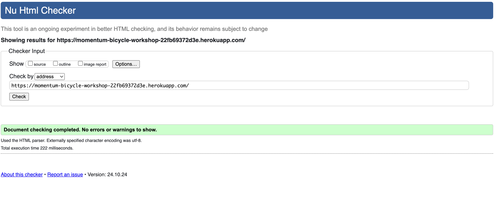
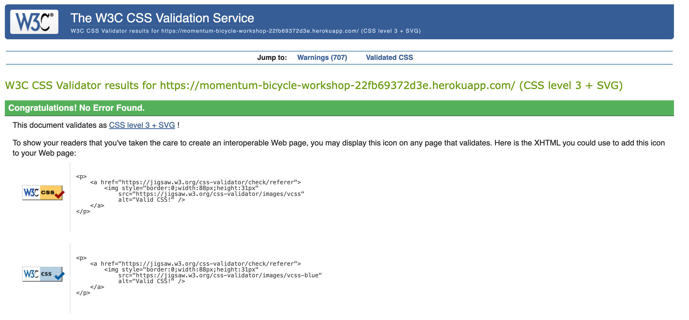

# Momentum Bicycle Workshop

The Momentum Bicycle Workshop website is an imaginery workshop for anyone who needs some sort of service to be carried out on their bicycle.
As one would say this would your local bike shop. It's not a frnachise or a big multi corporation, Momentum Bicycle Workshop is a small independent
business, that was openened with the aim to help out anyone who is having troubles with the bicycle. The main driving force behind the business is
the passion for cycling, promoting a healthier way of locomotion and the social aspects of cycling.

## Purpose 
The objective of this app/ website is to provide the user with a guidence and service regarding bicycle issues.
This project is my fourth milestone project of my Code Institute Full Stack Developer course.

## Requirement Gathering and Planning

Before starting the coding for this project, I took the time to think about how to set up the architecture of this app, the layout of the output on the frontend and the functionality required to provide a good user experience. 
To get some inspiration I did look around if there are any similar business and if so how does their website look like? (based on my location)

(https://bicycle-workshop.de/about)

(https://velovezh.ch/)

(https://www.imboden-bike.ch/en/workshop)

(https://aureusdrive.ch/en/about-us/blog/)

Well, it didn't take to long to notice, there isn't much out there on this market. From these businesses nothing stood out.
I really like an aesthetically pleasing look of website, regardless of what is the website related to.
Seems like bigger companies have a well structured, more complex website, with additional e-commerce functionality.
But I was after the small local shop "feeling", and some of those businesses don't even have a website...so right there is a small
market gap for simple, but nice websites with few basic functions. Once I realized this, this was/is my vision throughout the process.

## User Demographics, Stories and Needs

A small, friendly business perhaps could connect with the custumers better, making them returning customer in the long run.
Momentum Bicycle Workshop is targeting everybody on bikes. The from daily commuters to the weekend leisure riders and even the competitive- sporty riders.

### Target Demographic

This website is useful for anyone wanting to have a fast and reliable repair work done on his/ her bicycle.

 Some examples of such users are: 

- The teenager who rides bike daily to school and has a puncture.
- The hipster university student who will head for beers with his friends, but he would like to show off his new pedals. 
- The pensioner grandma who rides her bike once a week to the market, but it's been a while now since that bike had a full maintenance job.

### User Stories

|As website user for a service, I want to... | So that... |
|--------|--------|
| ...be able to find a bike shop online, that is nearby. | ...I can plan my visit to the workshop. |
| ...get information on the prices of the services. | ...I can make and informed decision on what service I need.|
| ...be able to call or email the workshop. | ...I can have specific questions with regards to the services. |
| ...be able to register on the shop's system. | ...I can schedule an appointment for bike repairs. |
| ...to be able to modify or delete my existing appointments. | ...in case for some reason I cannot make it to the original appointment. |

## Technologies Used

### Language Used

+ Python
* HTML
- CSS

### Frameworks, Libraries & Programs Used

1. Code Institue template: 
+ The foundations are based on Code Institutes Blog project in the study material.

2. Django

3. Bootstrap:

4. GitHub
- Github was used to store the project after being pushed

5. Code Editor
- To write and run the code GitHub' Code editor was used.

6. Favicon

### Data Model

The data model and the use of 'CRUD' operations are central to the functioning of the app. 

### Authenticatin, Validation

1. Authentication of customers at log in 

2. Authentication of 'shop owner' at login
    
3. Authentication of 'super user' at website admin log in

4. Validation of restricted days/ times at appointment booking

5. Validation of appointment cancellation
  

#### To be implemented
- A user friendly calendar view to book appointments instead of the old fashioned scroll down list

- A system to prioritise jobs for shop owner such as 'in progress' - 'completed'

- 'Where to find us' section with a map of the shop's location

- Contact details for existing appointments on the system

## Features

1. Navigation bar

2. Link to PDF price list

3. Registration

4. Log In page - for user and owner

5. Appointment - schedule for user and owner

6. Appointment - modification for user and owner

7. Photo upload - for user

8. Django Admin log in - for developer of the website

## Testing

I took a test-as-you-go approach - testing after each change to ensure that my desired outcome was achieved. 

I also completed an end-to-end test covering these aspects, at milestones throughout the project:

- Test each user journey from start to finish
- Test going home from every input possible
- Test every input with invalid inputs, empty inputs and wrong values (where applicable)

### Code Validation

- HTML validation

+ CSS validation

### Browser compatibility
Tested the application on **Chrome**, **Safari**, **Firefox**.
Appearance normal, functions working.

### Unfixed Bugs

- Appointment extraction for owner

## Deployment

This project was deployed to [Heroku](https://id.heroku.com/login): a hosting platform and is accessible via the mock terminal displayed on the [dedicated app page here](https://bmi-calculator-6b92d479472a.herokuapp.com/). 

These are the steps I took to set up my infrastructure and deploy my app:

1. Created a blank [Google Sheet](https://docs.google.com/spreadsheets/d/1dEQo7Hksi_dG7rFAgZyFmY7vDs_IfEl-ca-bAwBe-nA/edit?gid=1680754323#gid=1680754323) to store my data with the name 'bmi_calculator'.
2. Created a new project on the [Google Cloud Platform](https://console.cloud.google.com/welcome?project=portfolioprojectthree) by clicking 'New Project' from the project selection dropdown in the top menu bar.
3. Navigated to the 'Portfolioprojectthree' project page and clicked on 'APIs & Services' in the left hand burger menu. 
4. From here I enabled the 'Google Drive API' and navigated to the 'Credentials' section. I set the API being used as the 'Google Drive API' and the type of data I'll be accessing to 'Application Data'. I answered 'No' to the question asking me if I would be using one or more of a specific set of other services.
5. Next I set up the Service Account details with a name and the editor role, leaving everything else blank.
6. When this was created I clicked on the service account on the next page, and the 'Keys' tab, where I created a new JSON key file which I downloaded to my computer.
7. Next, I enabled the Google Sheets API. This was just a case of searching for this API on from the 'APIs & Services' page and clicking 'Enable'. Nothing further was required.
8. I created a new repository on my GitHub from the [Code Institute template](https://github.com/Code-Institute-Org/p3-template) and named it 'Portfolio-project-three'.
9. I opened this repo on my IDE and uploaded the JSON key file from earlier, renaming it 'creds.json'. This was then added to the gitignore file so that the credentials are not sent to GitHub.
10. The service account details from the creds.json file, listed as 'client_email' were added to the Google Sheet as a user to enable the app to read and write data from and to it. 
11. On Heroku, in the settings, a config var named 'CREDS' was created and the contents of the creds.json file were added to the value field, to enable Heroku to access the app. 
12. I added another config var called 'PORT' set to '8000' here too. 
13. Further dependencies required outside of those in the requirements.txt file found in my repository, were added via buildpacks on Heroku, again found in the settings. Firstly, 'python' and then 'nodejs' in that order.
14. Next I clicked on the 'Deploy' tab and connected my github repository code to the Heroku app. I clicked 'Manually deploy' and Heroku deployed the app for me. Once this was done, the link to the app appeared and could be clicked to go to the deployed app.

## Credits

### APIs and Third Party Libraries
1. [Google Sheets API: 'gspread'](https://docs.gspread.org/en/v6.0.0/) - This was installed to provide access to the associated spreadsheet which will hold all the data for BMI calculator.
2. [Date/Time Module: 'datetime'](https://docs.python.org/3/library/datetime.html) - This was installed to provide dates to work with, so a history of body weight and body mass index change can be made.

### BMI 
1. Calculation and formula of body mass index was taken from (https://www.diabetes.ca/resources/tools---resources/body-mass-index-(bmi)-calculator#:~:text=Body%20Mass%20Index%20is%20a,range%20is%2018.5%20to%2024.9.)
2. BMI chart to determine categories was taken from (https://calculatorsworld.com/health/bmi-chart-men-women-metric/#google_vignette)

### Sources of Learning
I referred back to the Love Sandwiches Walkthrough Project set up videos to remind me how to set up the APIs, credentials and files before starting coding.

### Acknowledgement 
Grateful for the help and the input from my mentor **Can Sücüllü**.
He always gave a different perspective on the issues and with his experience
and eyes for details I was guided in the right direction to make this project happen.

