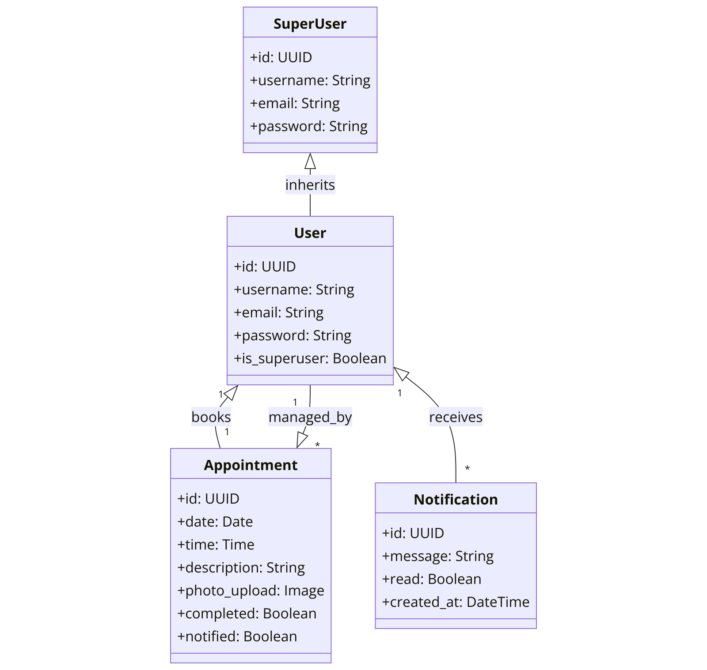
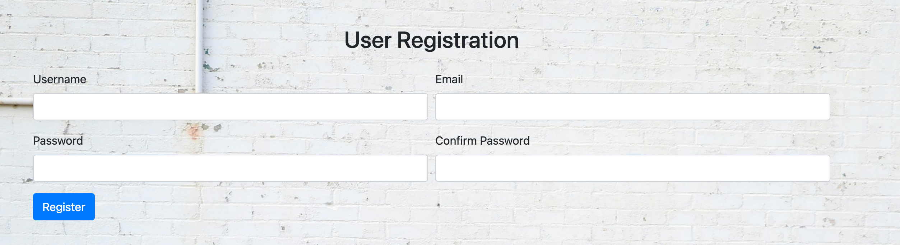
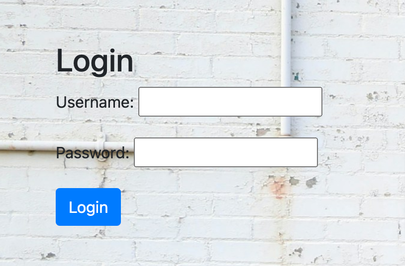
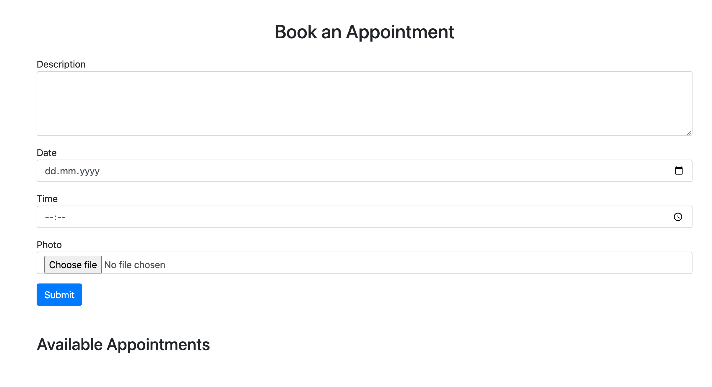
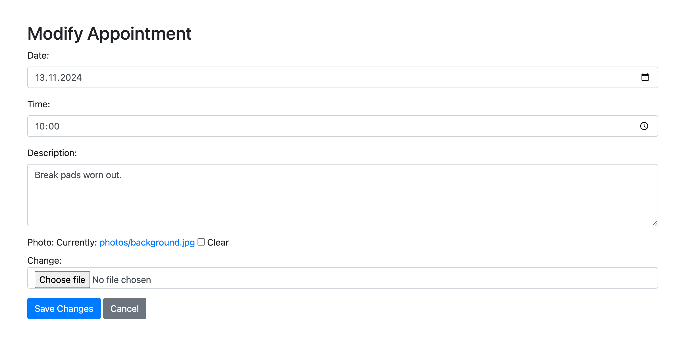
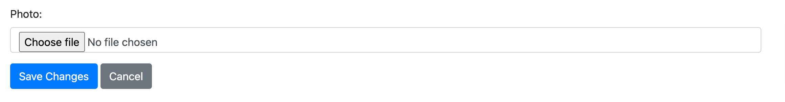
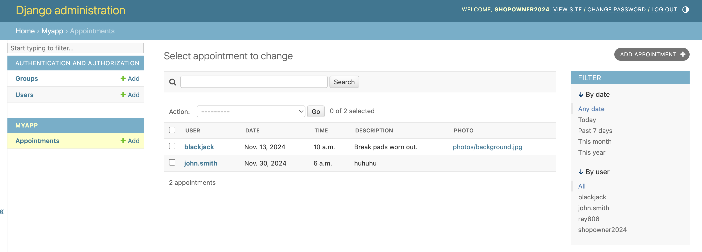
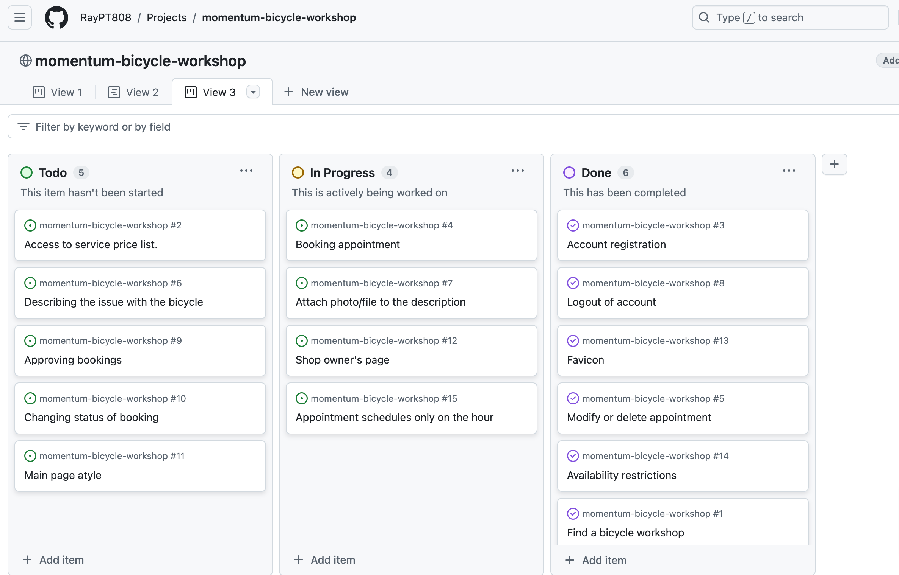

# Momentum Bicycle Workshop  
  

Momentum Bicycle Workshop is a web application designed to streamline bicycle repair bookings, manage appointments, and provide a seamless experience for customers and workshop owners.  

This project is my fourth milestone project for the **Code Institute Full Stack Developer course**.  

 **Live Demo**: [Click here](https://momentum-bicycle-workshop-22fb69372d3e.herokuapp.com/contact/) to visit the deployed version.  

---

##  Purpose  

Momentum Bicycle Workshop is an independent, small-scale bicycle repair business. Unlike large franchises, it focuses on **personalized service**, **community engagement**, and **a passion for cycling**.  

The website serves as a **digital hub** where users can:  
- Schedule repair appointments.  
- Manage their bookings.  
- Contact the shop for inquiries.  
- Stay informed about services and pricing.  

---
##  Requirement Gathering & Planning  

Before developing this project, I analyzed existing bicycle repair websites to identify common patterns and market gaps. Some references included:  
- [Bicycle Workshop](https://bicycle-workshop.de/about)  
- [Velovezh](https://velovezh.ch/)  
- [Imboden Bike](https://www.imboden-bike.ch/en/workshop)  
- [Aureus Drive](https://aureusdrive.ch/en/about-us/blog/)  

 **Key Insights:**  
- Many small bike shops lack an online presence.  
- Larger businesses have complex, feature-rich websites, but smaller shops need **simple yet effective solutions**.  
- There’s an opportunity for a **clean, user-friendly booking system** for local workshops.  

This vision shaped my design and development choices.  

---

##  Target Audience & User Stories  

Momentum Bicycle Workshop is **for anyone who rides a bicycle**, including:  
✔️ **Daily commuters** needing quick fixes.  
✔️ **Students** wanting stylish bike upgrades.  
✔️ **Seniors** looking for regular maintenance.  

### **User Stories**  

| As a user, I want to... | So that I can... |  
|----------------------|----------------|  
| Find a nearby bike shop | Plan my visit easily |  
| View service pricing | Make an informed decision |  
| Contact the workshop | Ask specific questions |  
| Register on the website | Schedule an appointment |  
| Modify or cancel appointments | Adjust plans if needed |  

---

##  Technologies Used  

### **Languages**  
- Python  
- HTML  
- CSS  

### **Frameworks, Libraries & Tools**  
1. **Django** – Backend framework for handling logic.  
2. **Bootstrap** – Frontend styling and responsiveness.  
3. **GitHub** – Version control & repository hosting.  
4. **GitHub’s Code Editor** – For writing and running the code.  
5. **Favicon Generator** – For browser tab icons.  

---

##  Data Model  

The web app follows **CRUD (Create, Read, Update, Delete) operations**, ensuring smooth appointment management.  

### **Authentication & Validation**  
 Secure login for **customers**, **shop owners**, and **admin users**.  
 Restriction of **appointment bookings** to available dates/times.  
 Validation for **cancellation policies** to prevent misuse.  

**ERD**

The database is structured using Django’s ORM, which maps Python classes to database tables.

**Key Entities:**
- User – Represents customers and shop owners.
- Appointment – Stores booking details (date, time, service description, status).
- Service – Different types of repair services offered.
- Workshop Owner – Special permissions to manage appointments

**Relationships:**

- A User can book one Appointment at the time (One-to-One).
- Each Appointment is linked to a specific Service (Many-to-One).
- A Workshop Owner can manage multiple Appointments.
- The Django authentication system handles user authentication and permissions.

This relational structure ensures data integrity, prevents duplicate bookings, and allows efficient scheduling.

---

  ##  Features  

1. **Navigation Bar** – Easy access to all pages.  
     

2. **Downloadable PDF Price List**  
     

3. **User Registration & Login**  
     
     

4. **Appointment Booking System**  
     

5. **Modify Appointments**  
     

6. **Photo Upload** (For users to share bike issues)  
     

7. **Django Admin Panel** (For the developer & shop owner)  
     

---

##  Future Enhancements  

 Planned features for future releases:  
 **Calendar-based booking system** (Instead of dropdown lists).  
 **Job prioritization for shop owners** (e.g., "In Progress" → "Completed").  
 **Interactive Map** (For shop location).  
 **Forgotten password recovery system**.  

---
##  Testing  

I used a **test-as-you-go approach**, ensuring each change worked correctly before moving forward. 

**Manual Testing**

Tested each user journey from start to finish.
Validated form inputs with valid/invalid data.
Checked authentication and authorization flows.
Ensured responsiveness across different browsers and devices.

### **Testing Checklist:**  
 End-to-end testing for all user journeys.  
 Validation of all form inputs (empty fields, incorrect values).  
 Browser compatibility testing on **Chrome, Safari, and Firefox**.  

### **Validation Results:**  
 **HTML Validation**   
 **CSS Validation**  
 **Functionality Testing**  

---

##  Deployment  

This project was deployed to **Heroku** and is accessible at:  
 [Live Site](https://momentum-bicycle-workshop-22fb69372d3e.herokuapp.com/)  

### **Deployment Steps**  
1. Create a **Heroku account** and install the CLI.  
2. Set up a **PostgreSQL database** for production.  
3. Push the code to **GitHub** and connect it to Heroku.  
4. Use `gunicorn` as the WSGI server for Django.  
5. Apply **migrations** and create a **superuser**.  
6. Deploy and verify all functionalities.  

---

## 👥 User Login Details (For Testing)  

### **Customer**  
- Username: `blackjack`  
- Password: `training2024`  

### **Shop Owner**  
- Username: `shopowner2024`  
- Password: `fixthebike`  

### **Django Admin**  
- Username: `shopowner2024`  
- Password: `fixthebike`  

 [Admin Panel](https://momentum-bicycle-workshop-22fb69372d3e.herokuapp.com/admin/myapp/appointment/)  

---

##  Credits  

### **APIs & Libraries**  
- **Django Documentation** – For authentication setup.  
- **Bootstrap Docs** – For styling and UI components.  

### **Project Management**  
- Used **GitHub’s Kanban Board** for task organization.  
    

### **Acknowledgment**  
 **Huge thanks to my mentor, Can Sücüllü**, for his valuable guidance, insights, and feedback throughout this project.  

---

 **This project was built with passion, problem-solving, and a love for cycling.**  
 **Happy riding, and keep your bikes in top shape!**  
