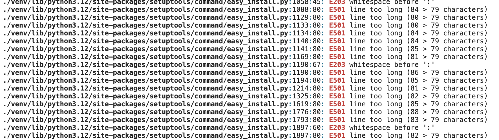

# Momentum Bicycle Workshop  
  

Momentum Bicycle Workshop is a web application designed to streamline bicycle repair bookings, manage appointments, and provide a seamless experience for customers and workshop owners.  

This project is my fourth milestone project for the **Code Institute Full Stack Developer course**.  

 **Live Demo**: [Click here](https://momentum-bicycle-workshop-22fb69372d3e.herokuapp.com/contact/) to visit the deployed version.  

---

##  Purpose  

Momentum Bicycle Workshop is an independent, small-scale bicycle repair business. Unlike large franchises, it focuses on **personalized service**, **community engagement**, and **a passion for cycling**.  

The website serves as a **digital hub** where users can:  
- Schedule repair appointments.  
- Manage their bookings.  
- Contact the shop for inquiries.  
- Stay informed about services and pricing.  

---
##  Requirement Gathering & Planning  

Before developing this project, I analyzed existing bicycle repair websites to identify common patterns and market gaps. Some references included:  
- [Bicycle Workshop](https://bicycle-workshop.de/about)  
- [Velovezh](https://velovezh.ch/)  
- [Imboden Bike](https://www.imboden-bike.ch/en/workshop)  
- [Aureus Drive](https://aureusdrive.ch/en/about-us/blog/)  

 **Key Insights:**  
- Many small bike shops lack an online presence.  
- Larger businesses have complex, feature-rich websites, but smaller shops need **simple yet effective solutions**.  
- There’s an opportunity for a **clean, user-friendly booking system** for local workshops.  

This vision shaped my design and development choices.  

---

##  Target Audience & User Stories  

Momentum Bicycle Workshop is **for anyone who rides a bicycle**, including:  
✔️ **Daily commuters** needing quick fixes.  
✔️ **Students** wanting stylish bike upgrades.  
✔️ **Seniors** looking for regular maintenance.  

### **User Stories**  

| As a user, I want to... | So that I can... |  
|----------------------|----------------|  
| Find a nearby bike shop | Plan my visit easily |  
| View service pricing | Make an informed decision |  
| Contact the workshop | Ask specific questions |  
| Register on the website | Schedule an appointment |  
| Modify or cancel appointments | Adjust plans if needed |  

---

**Minimal, practial layout**

**Easy-to-use Booking Platform**

##  Technologies Used  

### **Languages**  
- Python  
- HTML  
- CSS  

### **Frameworks, Libraries & Tools**  
1. **Django** – Backend framework for handling logic.  
2. **Bootstrap** – Frontend styling and responsiveness.  
3. **GitHub** – Version control & repository hosting.  
4. **GitHub’s Code Editor** – For writing and running the code.  
5. **Favicon Generator** – For browser tab icons. 
6. **Balsamiq** - For generating inital design 

---

##  Data Model  

The web app follows **CRUD (Create, Read, Update, Delete) operations**, ensuring smooth appointment management.  

### **Authentication & Validation**  
 Secure login for **customers**, **shop owners**, and **admin users**.  
 Restriction of **appointment bookings** to available dates/times.  
 Validation for **cancellation policies** to prevent misuse.  

**ERD**

The database is structured using Django’s ORM, which maps Python classes to database tables.

**Key Entities:**
- User – Represents customers and shop owners.
- Appointment – Stores booking details (date, time, service description, status).
- Service – Different types of repair services offered.
- Workshop Owner – Special permissions to manage appointments

**Relationships:**

- A User can book one Appointment at the time (One-to-One).
- Each Appointment is linked to a specific Service (Many-to-One).
- A Workshop Owner can manage multiple Appointments.
- The Django authentication system handles user authentication and permissions.

This relational structure ensures data integrity, prevents duplicate bookings, and allows efficient scheduling.

---

  ##  Features  

1. **Navigation Bar** – Easy access to all pages.  
     

2. **Downloadable PDF Price List**  
     

3. **User Registration & Login**  
     
     

4. **Appointment Booking System**  
     

5. **Modify Appointments**  
     

6. **Photo Upload** (For users to share bike issues)  
     

7. **Django Admin Panel** (For the developer & shop owner)  
     

---

##  Future Enhancements  

 Planned features for future releases:

 **Improving Lighthouse rating**  
 **Calendar-based booking system** (Instead of dropdown lists).  
 **Job prioritization for shop owners** (e.g., "In Progress" → "Completed").  
 **Interactive Map** (For shop location).  
 **Forgotten password recovery system**.  

---
##  Testing

**Automated Testing**

I implemented automated unit tests using Python's unittest module (or pytest, if used). 
These tests ensure that key functions work correctly without manual intervention.

    Example of Automated Tests:

- Test Appointment Booking – Ensures users can book appointments with valid inputs.
- Test Appointment Cancellation – Verifies that only authorized users can cancel an appointment.
- Test User Authentication – Checks if login/logout functionality works as expected.
- Test Home page load.

**Manual Testing**

I used a **test-as-you-go approach**, ensuring each change worked correctly before moving forward. 

Tested each user journey from start to finish.
Validated form inputs with valid/invalid data.
Checked authentication and authorization flows.
Ensured responsiveness across different browsers and devices.

**Lighthouse Accesibility Testing**

Lighthouse test results varied at different stages of the project. Earlier in development, scores were consistently high, but the final product scored lower. Despite testing on different devices, browsers, and clearing cache, the cause remains under investigation.

### **Testing Checklist:**  
 End-to-end testing for all user journeys.  
 Validation of all form inputs (empty fields, incorrect values).  
 Browser compatibility testing on **Chrome, Safari, and Firefox**.  
 

### **Validation Results:**  
 **HTML Validation**

    
 **CSS Validation**

   

 **Flake8 Validation**  

 The Flake8 validation returned a long list of errors in the code. The list was full of E501 error messages.
 Majority of the error originates from the code of the libraries as it turned out.

 

 There were also errors in the custom code, those ones have been reformatted (Black), but that process had impact on some of the functions and styles.
 It seemed to me as the choice is between perfectly formatted code or smooth user experience. 
 

 

---
 

 # Deployment to Heroku

 This project was deployed to **Heroku** and is accessible at:  
 [Live Site](https://momentum-bicycle-workshop-22fb69372d3e.herokuapp.com/)  

I took the following steps to deploy this Django project to Heroku, a popular cloud hosting platform. 

---

## Step 1: Create a PostgreSQL Database
1. **Create a PostgreSQL database** using your preferred provider. Since I'm a student at Code Institute, I used their PostgreSQL offering.
2. After creating the database, I made sure to note down the database URL, as I’ll need it later.

---

## Step 2: Create a New Heroku App
1. I went to [Heroku](https://www.heroku.com) and created a new app by clicking on the "New" button.
2. I chose a unique name for my app and selected the region closest to my location.

---

## Step 3: Configure the Database
1. In the **Settings** tab of my new Heroku app, I went to **CONFIG VARS**.
2. I added a new key-value pair:
   - **Key:** `DATABASE_URL`
   - **Value:** I pasted the database URL that I obtained from my PostgreSQL provider.

This allowed my Django app to connect to the Heroku database.

---

## Step 4: Connect GitHub Repository to Heroku
1. I cloned my repository from GitHub to my local machine.
2. In the **Deploy** tab of my Heroku app, I linked the Heroku app to my GitHub repository.
3. I selected my repository but I kept the 'manual' deployment option over the automatic deployment.

---
## Step 5: Configure Django Settings

I opened `settings.py` and made the following updates:
- I set `DEBUG = False` to ensure the app runs in production mode.
- I updated `ALLOWED_HOSTS` to include my Heroku app’s domain:
  ALLOWED_HOSTS = ['yourappname.herokuapp.com']
- I used os.environ.get() to access the environment variables I set in Heroku's Config Vars.

- I configured Django to use my PostgreSQL database by setting:
DATABASES['default'] = os.getenv('DATABASE_URL')

- To handle static files, I added Whitenoise for better static file management:
MIDDLEWARE = [
    'whitenoise.middleware.WhiteNoiseMiddleware',
    # other middleware
]

---
 ## Step 6: Install Dependencies
I made sure all dependencies were installed by running:
pip install -r requirements.txt

---

## Step 7: Collect Static Files
I collected the static files in my project to prepare them for Heroku by running:
python manage.py collectstatic

---

## Step 8: Add the Python Buildpack on Heroku
In the Settings tab on Heroku, I scrolled down to Buildpacks and added the Python buildpack.

---

## Step 9: Run Database Migrations
I applied the database migrations to set up my PostgreSQL database by running:
python manage.py migrate

---
## Step 10: Create a Superuser
I created a Django superuser to access the admin interface by running:
python manage.py createsuperuser

---
## Step 11: Deploy the App
In the Deploy tab on Heroku, I clicked on Deploy Branch to manually deploy my app.

---

## 👥 User Login Details (For Testing)  

### **Customer**  
- Username: `blackjack`  
- Password: `training2024` 

- Username: `speed02`
- Password: `Saturday22`

### **Shop Owner**  
- Username: `shopowner2024`  
- Password: `fixthebike`  

### **Django Admin**  
- Username: `shopowner2024`  
- Password: `fixthebike`  

 [Admin Panel](https://momentum-bicycle-workshop-22fb69372d3e.herokuapp.com/admin/myapp/appointment/)  

---

##  Credits  

### **APIs & Libraries**  
- **Django Documentation** – For authentication setup.  
- **Bootstrap Docs** – For styling and UI components.  

### **Project Management**  
- Used **GitHub’s Kanban Board** for task organization.  
    

### **Acknowledgment**  
 **Huge thanks to my mentor, Can Sücüllü**, for his valuable guidance, insights, and feedback throughout this project.  

---

 **This project was built with passion, problem-solving, and a love for cycling.**  
 **Happy riding, and keep your bikes in top shape!**  
